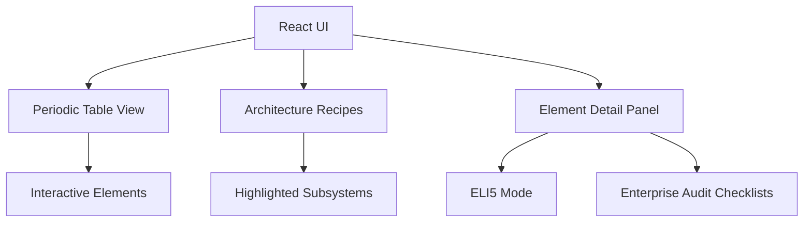

# AI Periodic Table — Architecture

*Navigation: [Project Overview](project-overview.md) | [Conventions](conventions.md) | [Taxonomy](taxonomy.md)*

## System Diagram

## Layers
- **UI Layer**: React components handling layout, interactivity, and visual feedback (hover/click).
- **Data Layer**: Static definitions (`src/data.js`) holding element details, groups, maturity stages, and audit questions.
- **Recipe Engine**: Logic (`src/recipes.js`) that defines architecture patterns and highlights specific components on the table.

## Key Patterns
- **Static Site Generation / SPA**: Fully static SPA compiled via Vite.
- **Data-Driven UI**: The UI structure (table rows, columns, colors) is driven directly by the `data.js` definitions.
- **Component Filtering**: Recipes filter and highlight specific elements while dimming others.
