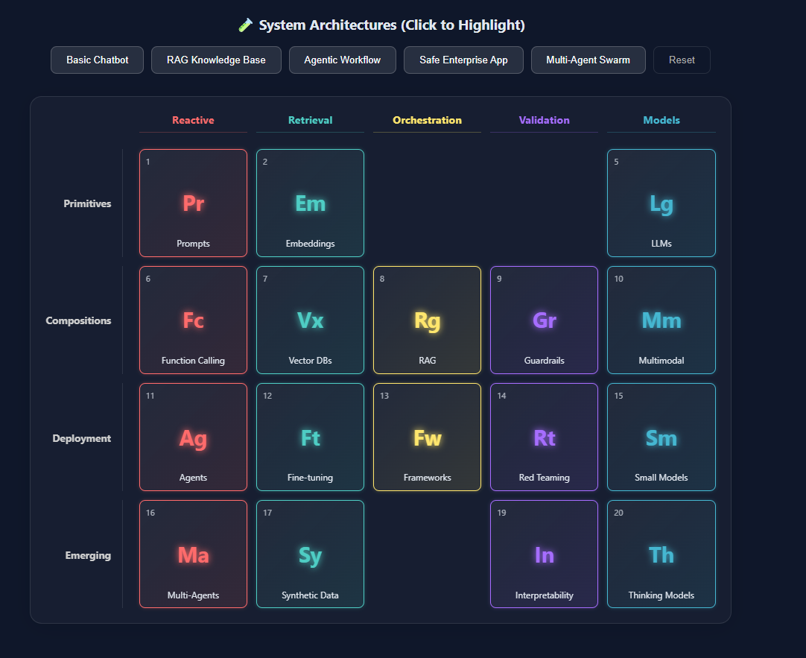

# 🧪 Interactive AI Periodic Table

[](https://ai-corner.github.io/ai-periodic-table/)
[](https://opensource.org/licenses/MIT)
[](CONTRIBUTING.md)

> A visual, interactive tool for understanding AI system architectures - from simple chatbots to complex multi-agent systems.

## 🌐 [**View Live Demo →**](https://ai-corner.github.io/ai-periodic-table/)



## 🌟 What is This?

The **AI Periodic Table** organizes AI components like chemistry elements - across rows of maturity stages and columns of functional families. This interactive web application transforms the static concept into a powerful learning and design tool.

### Why It Matters

- **For Students**: Learn AI concepts through simple "Explain Like I'm 5" descriptions
- **For Developers**: Design systems using architecture recipes (RAG, Agents, Multi-Agent)
- **For Enterprises**: Audit AI systems with built-in governance checklists
- **For Everyone**: Understand what AI systems actually do, not just the marketing hype

## ✨ Features

### 🎯 Interactive Periodic Table
- **Hover to Learn**: Click any element to see detailed explanations
- **Color-Coded Groups**: Visual distinction between Reactive, Retrieval, Orchestration, Validation, and Models
- **Row & Column Labels**: Understand maturity (Primitives → Emerging) and capabilities at a glance

### 🏗️ System Architecture Recipes
Highlight complete system architectures with one click:
- **Basic Chatbot** (Pr + Lg)
- **RAG Knowledge Base** (Pr + Em + Vx + Rg + Lg)
- **Agentic Workflow** (Pr + Fc + Ag + Lg + Fw)
- **Safe Enterprise App** (with Guardrails + Red Teaming)
- **Multi-Agent Swarm** (Ma + Ag + Sy + Fw)

Each recipe includes detailed explanations of *why* specific components are needed.

### 🛡️ Enterprise Audit Checklists
For production-critical elements (Agents, Embeddings, Vector DBs), get:
- **Inventory & Audit Questions**: What to document
- **Security Controls**: How to protect
- **Compliance & Governance**: Regulatory alignment

### 👶 ELI5 Mode
Every row and family includes child-friendly explanations:
- "The Basic LEGO Bricks" (Primitives)
- "The Doers" (Reactive Group)
- "The Memory Keepers" (Retrieval Group)

### 📚 Real-World Scenarios
Before/After comparisons showing how the table helps:
- **The Builder**: Student fixing chatbot hallucinations
- **The Manager**: Enterprise lead adding safety to production systems

## 🚀 Quick Start

### Prerequisites
- Node.js 16+ and npm

### Installation

```bash
# Clone the repository
git clone https://github.com/AI-Corner/ai-periodic-table.git
cd ai-periodic-table

# Install dependencies
npm install

# Start development server
npm run dev
```

Visit `http://localhost:5173` to see the app running locally.

### Build for Production

```bash
npm run build
```

The optimized build will be in the `dist/` folder.

## 🎨 How to Use

1. **Explore Elements**: Hover over or click any element to learn what it does
2. **Try Architecture Recipes**: Click "Basic Chatbot" or "RAG System" to see which components light up
3. **Read Explanations**: Each recipe shows *why* those specific elements are needed
4. **Check Audit Lists**: Click elements with 🛡️ icons to see enterprise governance questions
5. **Learn the Mental Model**: Use the "How to Read This Table" guide at the top

## 🤝 Contributing

We welcome contributions from the community! Here's how you can help:

### 🎯 Ways to Contribute

#### 1. Add New Architecture Recipes
Have a common AI pattern we're missing? Add it to `src/recipes.js`:

```javascript
{
  id: 'your-recipe',
  name: 'Your Architecture Name',
  desc: 'One-line description',
  elements: ['Pr', 'Lg', 'Fc'], // Element symbols
  explanation: "Detailed explanation of why these components..."
}
```

**Ideas we'd love to see:**
- Code Generation Assistant
- Real-time Translation System
- Autonomous Research Agent
- Content Moderation Pipeline

#### 2. Enhance Element Descriptions
Make explanations clearer or add missing `audit` data to elements in `src/data.js`.

#### 3. Add More Elements
The original IBM framework is evolving. If new elements emerge (e.g., "Memory Systems", "Tool Use"), propose them!

#### 4. Improve Accessibility
- Add keyboard navigation
- Improve screen reader support
- Enhance mobile responsiveness

#### 5. Create Tutorials
- Video walkthroughs
- Blog posts explaining specific architectures
- Integration guides for using this in education

### 📝 Contribution Process

1. **Fork** the repository
2. **Create a branch**: `git checkout -b feature/your-feature-name`
3. **Make your changes** and test locally
4. **Commit**: `git commit -m "Add: your feature description"`
5. **Push**: `git push origin feature/your-feature-name`
6. **Open a Pull Request** with a clear description

### 🐛 Report Issues

Found a bug or have a suggestion? [Open an issue](https://github.com/AI-Corner/ai-periodic-table/issues) with:
- Clear description
- Steps to reproduce (for bugs)
- Expected vs actual behavior
- Screenshots if applicable

## 📖 References & Inspiration

This framework is based on the **"AI Periodic Table"** concept originally presented by **Martin Keen at IBM Technology**.

📺 [Watch the Original Explanation Video](https://www.youtube.com/watch?v=ESBMgZHzfG0)

Additional inspiration and audit frameworks from:
- Valdez Ladd's "IBM's AI Periodic Table Framework for Enterprise AI Audit Checklists"
- Mani Gopalakrishnan's "The AI Periodic Table: A Practical Mental Model"

## 🛠️ Tech Stack

- **React 18** - UI framework
- **Vite** - Build tool
- **Vanilla CSS** - Styling (no frameworks for maximum control)
- **GitHub Pages** - Deployment

## 📄 License

This project is licensed under the MIT License - see the [LICENSE](LICENSE) file for details.

## 🌐 Community

- **Discussions**: [GitHub Discussions](https://github.com/AI-Corner/ai-periodic-table/discussions)
- **Issues**: [Report bugs or request features](https://github.com/AI-Corner/ai-periodic-table/issues)
- **Organization**: [AI-Corner on GitHub](https://github.com/AI-Corner)

## 🙏 Acknowledgments

- **Martin Keen** and **IBM Technology** for the original AI Periodic Table concept
- The open-source community for inspiration and tools
- All contributors who help make this resource better

---

**Made with ❤️ by the AI-Corner community**

*Star ⭐ this repo if you find it useful!*
